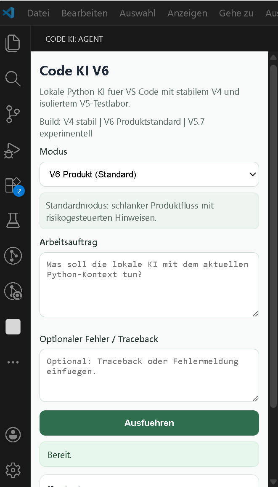

# Code KI V6

[](https://opensource.org/licenses/MIT)
[](https://www.python.org/downloads/)
[](https://github.com/mickhornung-oss/code-ki-v6/releases)
[](https://codecov.io/gh/mickhornung-oss/code-ki-v6)
[](https://github.com/mickhornung-oss/code-ki-v6/actions)

Lokale Python-KI fuer Visual Studio Code mit produktnahem Standardmodus:
Prompt rein, Code raus - mit Leitplanken im Hintergrund.

## 📸 Demo

**VS Code Extension Agent Panel:**



*Agent Mode: Wähle deinen Modus (V6 Produkt, Projekt-Agent, etc.), beschreibe deine Aufgabe, und lass die KI arbeiten.*

## ⚡ Quick Start

```powershell
# 1. Virtual Environment aktivieren
.\venv\Scripts\Activate.ps1

# 2. Abhaengigkeiten installieren
pip install -r requirements.txt

# 3. Backend starten
powershell -File .\scripts\start_backend.ps1

# 4. VS Code Extension laden
# Öffne Code KI V6 in VS Code → Extension aktiviert sich automatisch
```

→ Dann: Command Palette → "Code KI V6: Seitenleiste oeffnen"

## Status

- V4 bleibt stabile technische Basis.
- V5 bleibt isoliertes Testlabor (opt-in).
- V6 ist der neue Minimal Product Flow im Standardmodus (`agent_v6`).

## Projektstruktur

- `backend/` FastAPI-Backend, Modelllaufzeit, V4/V5/V6-Flowlogik
- `vscode-extension/` VS-Code-Extension (Produktmodus + isolierter Laborpfad)
- `config/` Laufzeitkonfiguration
- `scripts/` Start/Stop/Test-Skripte
- `tests/` Python-Tests
- `docs/` Architektur, Projektstand, Test- und Produktdoku

## Schnellstart

1. vEnv aktivieren: `.\.venv\Scripts\Activate.ps1`
2. Abhaengigkeiten installieren: `python -m pip install -r requirements.txt`
3. Backend starten: `powershell -File .\scripts\start_backend.ps1`
4. Backend pruefen: `powershell -File .\scripts\status_backend.ps1`
5. Tests:
   - V6: `powershell -File .\scripts\test_v6_repo.ps1`
   - V4 Regression: `powershell -File .\scripts\test_v4_repo.ps1`
   - V5 Labor: `powershell -File .\scripts\test_v5_full_flow.ps1`

## Modi in der Extension

Command Palette:
- `Code KI V6: Seitenleiste oeffnen` (Standardpfad)
- `Code KI V6: Legacy-Panel oeffnen` (nur Sonderfall/Debug)

Modi:
- `V6 Produkt (Standard)` (Default)
- `Projektagent (autonom nach Freigabe)`
- `Python-Aufgabe`
- `Ueberarbeiten`
- `Erklaeren`
- `V4 Agent (kontrolliert)`
- `V5.7 Testlabor (...)` (isoliert, experimentell)

## V6 Minimal Product Flow

Standardverhalten:
1. Auftrag eingeben
2. strukturierte Antwort/Codevorschlag erhalten
3. optional kontrolliert anwenden
4. optional Pruefschritt ausfuehren
5. klaren Abschlussstatus sehen

Risikogesteuerte Zusatzsichtbarkeit:
- `low`: kompakte Ausgabe
- `medium`: zusaetzlicher Risikohinweis
- `high`: zusaetzlicher Review-Hinweis vor Apply

## Projektagent (autonom, begrenzt)

- Modus: `agent_project` (UI: `Projektagent (autonom nach Freigabe)`)
- Start nur mit expliziter Autonomie-Freigabe
- arbeitet nur innerhalb des erlaubten Projektordners (`workspace_root`)
- blockiert und eskaliert bei:
  - externen Eingriffen (z. B. Installations-/Download-Kommandos)
  - Vorschlaegen ausserhalb des Projektordners
- fuehrt innerhalb des Projektordners kontrolliert Apply/Test-Kette aus

## Single-Window-Pfad

- Activity-Bar-Container `Code KI` mit Sidebar-View `Agent` ist die Hauptoberflaeche.
- Normalbetrieb laeuft im selben VS-Code-Fenster ohne Panel-Zwang.
- Das Panel ist nur noch als Legacy-/Debug-Pfad verfuegbar.
- Dev-Host bleibt Entwicklungs-/Testpfad.

## Sidebar-Abnahme (Endnutzerpfad)

- Manueller produktnaher Pruefpfad:
  - `docs/manual_sidebar_acceptance.md`

## Packaging (Release)

- Im Ordner `vscode-extension`:
  - `npm run package`
- Ergebnis: `.vsix`-Paket fuer die Extension.

## Release-/Freeze-Stand

- Abschlussdoku:
  - `docs/release_freeze.md`

## Abgrenzung V4/V5/V6

- V4: kontrollierter Agentenmodus mit sichtbarer Plan-/Checkpoint-Logik.
- V5: isoliertes Labor fuer experimentelle Mehrstufen-Interaktion.
- V6: schlanker Produktmodus; nutzt V5-Erkenntnisse intern, aber ohne Laborpflichtkette im Standardfall.

## Wichtige Skripte

- `scripts/start_backend.ps1`
- `scripts/status_backend.ps1`
- `scripts/stop_backend.ps1`
- `scripts/test_backend.ps1`
- `scripts/test_v4_repo.ps1`
- `scripts/test_v5_lab.ps1`
- `scripts/test_v5_full_flow.ps1`
- `scripts/test_v6_repo.ps1`
- `scripts/test_product_agent_repo.ps1`

## Dokumentation

- [docs/architecture.md](docs/architecture.md)
- [docs/project_documentation.md](docs/project_documentation.md)
- [docs/manual_sidebar_acceptance.md](docs/manual_sidebar_acceptance.md)
- [docs/release_freeze.md](docs/release_freeze.md)
- [docs/v5_testlab.md](docs/v5_testlab.md)
- [docs/v5_closure_v6_preparation.md](docs/v5_closure_v6_preparation.md)
- [docs/project_agent_mode.md](docs/project_agent_mode.md)
