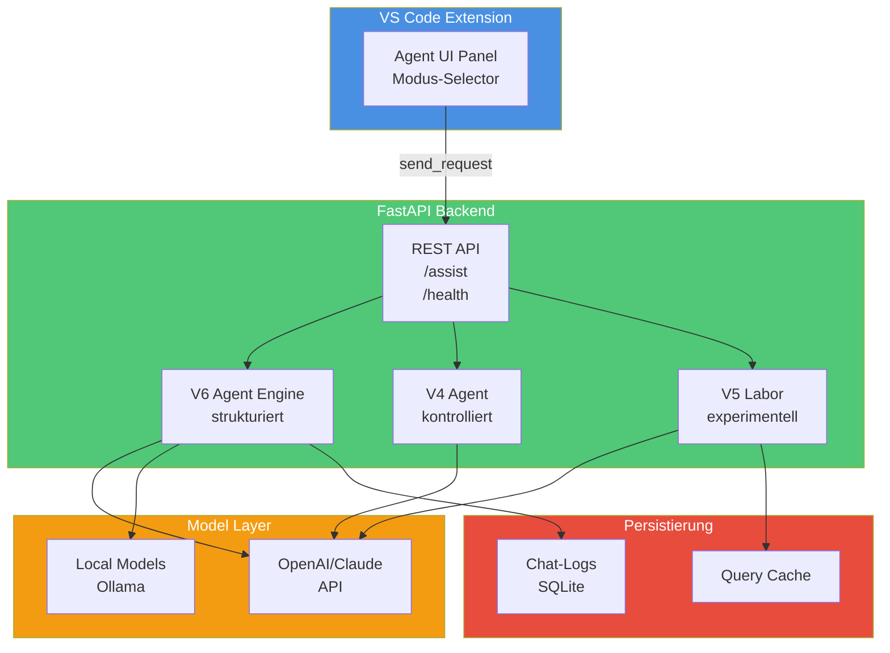

# Architektur V6 (Produkt) mit V4-Basis und V5-Labor

## System Design Diagram

## Ziel

Code KI V6 liefert einen produktnahen Standardfluss fuer Python-Arbeitsauftraege in VS Code:
Prompt rein, Code raus - mit Leitplanken im Hintergrund.

## Hauptbausteine

1. Extension (`vscode-extension/extension.js`)
- sammelt Editor-Kontext (aktive Datei, Auswahl, Workspace-Dateiindex)
- sendet Auftrag an `/assist`
- zeigt strukturierte Antwort + V6-Produktstatus
- ermoeglicht kontrolliertes Apply mit Sicherheitsabfrage
- bietet Pruefschritt-Ausfuehrung im Editor
- haelt V5-Labor-UI isoliert und opt-in
- bietet Single-Window-Hauptansicht ueber Activity-Bar + Sidebar-View
- panelbasierter Einstieg nur als Legacy-/Debug-Pfad

2. Backend API (`backend/app.py`)
- `/health`
- `/assist`

3. Service-Schicht (`backend/service.py`)
- baut Prompt und Kontext
- ruft lokales Modell
- parst strukturierte Antwort
- erzeugt Testschritt/Testresultat
- erzeugt im Modus `agent_v4` den V4-Workflow
- erzeugt im Modus `agent_v5_lab` den V5-Laborworkflow
- erzeugt im Modus `agent_v6` den V6-Produktflow
- erzeugt im Modus `agent_project` den Projektagent-Flow

4. V4-Workflow (`backend/v4_workflow.py`)
- Mini-Plan mit Schrittstatus
- relevante Dateiauswahl
- Kontrollpunkte (z. B. vor Apply)
- finale Ablaufbewertung
- Guardrails fuer aktiven Python-Kontext

5. V6-Produktflow (`backend/v6_product_flow.py`)
- schlanker Produktmodus mit kompakter Ergebnisdarstellung
- risikogesteuerte Zusatzsichtbarkeit (`risk_notice`, `review_before_apply`)
- interne Mechanikhinweise (V5-inspiriert, ohne Laborpflichtkette im Standardmodus)

6. Projektagent-Flow (`backend/project_agent_flow.py`)
- autonome Mehrschrittlogik nach expliziter Freigabe
- Eskalation bei externen Blockern und out-of-scope Zugriffen
- klare Schritt-/Statussicht fuer den Agentenlauf

7. Projektordner-Guardrails (`backend/project_guardrails.py`)
- scope-validierung fuer Request-Kontext
- Pfadgrenzen innerhalb `workspace_root`
- Erkennung externer Blocker (Install/Download)

8. Kontext-Schicht (`backend/context_builder.py`)
- kontrolliertes Clipping
- Zusatzdateien
- begrenzter Workspace-Dateiindex

9. Test-Runner (`backend/test_runner.py`)
- sichere Syntaxpruefung
- kontrollierte Testbefehle (Allowlist)
- nur mit gueltigem Projektordner-CWD

## V6-Ablauf (Standard)

1. Auftrag empfangen
2. strukturierte Antwort erzeugen
3. Risiko einstufen (low/medium/high)
4. kompakte Produktausgabe anzeigen
5. optional anwenden + optional pruefen
6. klaren Abschlussstatus bereitstellen

## Kontrollpunkte und Sichtbarkeit

- V6 zeigt im Standardfall eine schlanke Ausgabe.
- Zusatzsichtbarkeit wird nur bei Risiko eingeblendet.
- Harte Blockierung bei fehlender/ungeeigneter aktiver Python-Datei bleibt aktiv.
- V5-Labor bleibt als separater, expliziter Testpfad erhalten.

## Sicherheitsleitplanken

- Apply nur manuell + Sicherheitsdialog
- deterministische Apply-Engine mit Konfliktblockierung
- keine freien Shell-Kommandos ausser enger Test-Runner-Policy

## Warum diese Architektur

- nutzt den stabilen V3/S1/S2-Kern weiter
- fuehrt Produktmodus schlank statt laborartig
- nutzt V5-Erkenntnisse intern, ohne V5 als Pflicht-UI
- bleibt lokal, nachvollziehbar und testbar
